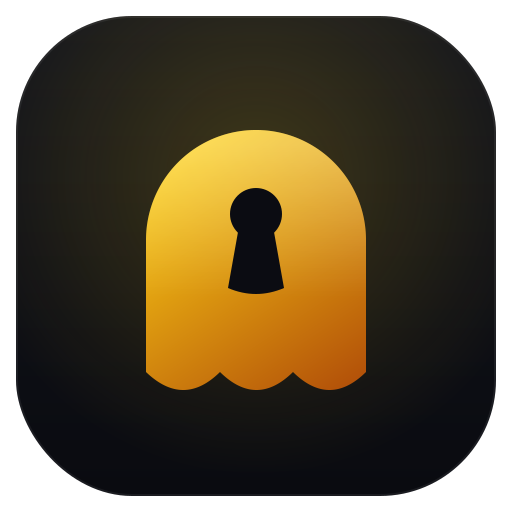

<p align="center">
  
</p>

<h1 align="center">ghostvault</h1>

ghostvault is a key management system (KMS) with envelope encryption, packaged as
a single command line tool. It generates and manages cryptographic keys, supports
key rotation, encrypts and decrypts data with a data-encryption-key /
key-encryption-key (DEK/KEK) envelope scheme, seals and unseals secrets, and keeps
an append-only audit log. It is a defensive tool built on vetted primitives from
the Python `cryptography` library.

ghostvault does not invent cryptography. It composes standard, reviewed building
blocks (scrypt for key derivation, AES-256-GCM for authenticated encryption).

## Security model and threat model

ghostvault protects key material and data at rest on a single host. The root
key-encryption-key is derived from a passphrase with scrypt and a per-vault random
salt, and is held in memory only for the duration of a command. Every named key
(a KEK) is a random AES-256 key stored encrypted (wrapped) under the root key.
Data is protected with envelope encryption (see below). All encryption is
authenticated (AES-GCM), so tampering, a wrong key, or a wrong context causes
decryption to fail closed rather than return garbage.

What ghostvault assumes and does not defend against:

- It protects data and keys at rest. It does not defend against an attacker who can
  read your process memory while the vault is open, or who can capture your
  passphrase via keylogging.
- The strength of the vault rests on the strength of the passphrase. A weak
  passphrase can be brute forced offline; scrypt raises the cost but does not make a
  weak passphrase safe.
- It is not a networked service and has no access control beyond the passphrase and
  filesystem permissions.
- It is not a substitute for a cloud HSM or managed KMS in production. For
  high-assurance production use, prefer a hardware-backed KMS (for example a cloud
  KMS or an HSM) that keeps key material in tamper-resistant hardware.

## Crypto design

- Key derivation (KDF): the root KEK is derived from the passphrase using scrypt
  with a per-vault random salt. The passphrase is never stored. A small verifier
  ciphertext is stored so an incorrect passphrase is detected on open.
- KEKs: each named key is a random AES-256 key. Each key version is stored
  encrypted (wrapped) under the root key using AES-256-GCM. Metadata records the
  key id, versions, state (enabled or disabled), algorithm, and timestamps, but
  never any plaintext key bytes.
- Envelope encryption: `encrypt` generates a fresh random DEK, encrypts the
  plaintext with the DEK under AES-256-GCM, then wraps (encrypts) the DEK under the
  named KEK version. The output is a self-describing, versioned JSON blob carrying
  the key id, key version, algorithm, context, the wrapped DEK, and the
  DEK-encrypted ciphertext (each AES-GCM segment includes its own nonce and tag).
- Associated data (AAD) context: an optional context string is bound as AES-GCM
  associated data on the data layer. Decryption must supply the same context, so a
  ciphertext is cryptographically bound to its context.
- Rotation: `key rotate` adds a new key version. New encryptions use the latest
  version; older versions are retained so existing ciphertext still decrypts.
  Disabling a key blocks new encryption while leaving existing ciphertext
  decryptable.
- Authenticated encryption everywhere: AES-256-GCM provides confidentiality and
  integrity. Any tampering or mismatch fails closed.

## Vault layout

A vault is a directory (default `./.ghostvault`) containing:

- `metadata.json`: format version, KDF salt and parameters, passphrase verifier,
  and key descriptors with wrapped key material. No plaintext key bytes.
- `secrets.json`: the secret store, each entry an envelope-encrypted blob.
- `audit.log`: append-only JSONL of operations (op, key id, timestamp, success).

## Install

Requires Python 3.11 or newer.

```
git clone https://github.com/joemunene-by/ghostvault.git
cd ghostvault
python -m venv .venv
source .venv/bin/activate
pip install -e .
```

For development (tests and linting):

```
pip install -e ".[dev]"
```

## Passphrase handling

The passphrase can be supplied non-interactively through the
`GHOSTVAULT_PASSPHRASE` environment variable, or entered at a hidden prompt when
the variable is unset. The passphrase is never written to disk.

```
export GHOSTVAULT_PASSPHRASE="a-strong-passphrase"
```

## Quickstart

```
# Create a vault
ghostvault init --vault ./.ghostvault

# Create a key (a KEK)
ghostvault key create app --vault ./.ghostvault

# Encrypt a string, binding it to a context
echo -n "top secret payload" | \
  ghostvault encrypt --key-id app --vault ./.ghostvault --context tenant-a \
  --input - --output blob.json

# Rotate the key (new encryptions use version 2)
ghostvault key rotate app --vault ./.ghostvault

# Decrypt the original blob (still works after rotation)
ghostvault decrypt --vault ./.ghostvault --context tenant-a \
  --input blob.json --output -

# Seal and unseal a named secret
echo -n "db-password-value" | \
  ghostvault seal db-password --key-id app --vault ./.ghostvault --input -
ghostvault unseal db-password --vault ./.ghostvault --output -

# Show the audit log
ghostvault audit --vault ./.ghostvault
```

Sample audit output:

```
                          Audit log
Timestamp                          Operation    Key ID   Success   Detail
2026-06-21T00:00:00+00:00          init                  yes
2026-06-21T00:00:00+00:00          key.create   app      yes
2026-06-21T00:00:00+00:00          encrypt      app      yes       v1
2026-06-21T00:00:00+00:00          key.rotate   app      yes       v2
2026-06-21T00:00:00+00:00          decrypt      app      yes       v1
2026-06-21T00:00:00+00:00          seal         app      yes       db-password
2026-06-21T00:00:00+00:00          unseal       app      yes       db-password
```

## Commands

- `init`: create a new vault.
- `key create <key-id>`: create a new key.
- `key list`: list keys (`--format table|json`).
- `key rotate <key-id>`: add a new key version.
- `key disable <key-id>`: block a key from new encryption.
- `encrypt --key-id <id>`: envelope-encrypt data (`--input`, `--output`, `--context`).
- `decrypt`: decrypt a ghostvault blob (`--input`, `--output`, `--context`).
- `seal <name> --key-id <id>`: encrypt and store a named secret.
- `unseal <name>`: retrieve and decrypt a named secret.
- `audit`: show the audit log (`--format table|json`).
- `version`: show the version.

Common flags: `--vault` (vault path), `--verbose` (debug logging).

## Limitations

- Single-host, file-backed. No clustering, replication, or networked access.
- Key material lives in process memory while a vault is open and is only as safe as
  the host and the passphrase.
- Not a substitute for a cloud HSM or managed KMS in production. ghostvault is a
  practical, auditable software KMS for local and small-scale use, learning, and
  defensive tooling, not a hardware-backed key store.

## Roadmap

- Pluggable KDF selection (Argon2id alongside scrypt).
- Per-key access policies and key usage limits.
- Optional encrypted audit log and tamper-evident chaining.
- Re-encryption (rewrap) helper to migrate ciphertext to a new key version.
- Optional integration shims for cloud KMS backends as the wrapping authority.

## License

MIT. See [LICENSE](LICENSE).
